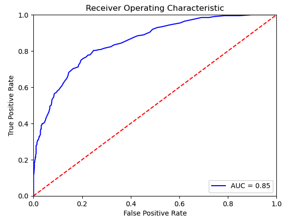

## Available Data

In This folder you will find the rate of prescriptions for each county over a 4 year period.  Ideally you will find this in the main branch of our project with the paragraph below included in our main ReadMe.

One of the many dependent factors on our analysis we are hoping to include is that of the amount of opioids prescribed in each county.  The simple idea being that one major talking point of the opioid crisis in the US is that it is in part due to the number of prescription opioids used as painkillers in medicine.  These rates can be found on the [CDC website](https://www.cdc.gov/drugoverdose/rxrate-maps/index.html) and essentially say the number of prescriptions filled per 100 people over the course of the year.

### Patrick's Info for my slide(s)
I was responsible for our Random Forest model, which we used to try and identify if a county would be in the to 25% by crude rate based on our features.  Futhermore, we wanted to use the Random Forest model to identify which features would be most significant.

I would talk us through the results, but some of the major points, Accuracy Score of .81 so decent.  Precision which is the reliability to trust the result(.84 for class 0 and .72 for class 1) and Recall which is how many which were 0/1 were diagnosed 0/1 (.93 for 0 and .48 for 1), I want to highlight this would err on the side of false negatives. 

The importance of the included features can be seen here.  The two most important features are population and then percapitaincome 

The Receiver Operating Characteristic Curve and the AUC score can be seen here.  This is a meaure of the True positive rate vs the false positive rate.  Note that it is looking at the probabilties of how each datapoint is classified instead of the final outcome. 

Because categorizing the data essentially means we have one "Class" with less results I tried out using the SMOTEEN process in conjunction with the Random Forest Model to generate more data.  The model wasn't quite as good as can be seen below, although it does have a higher recall for class 1 which means it would err on the side of false positives. 
